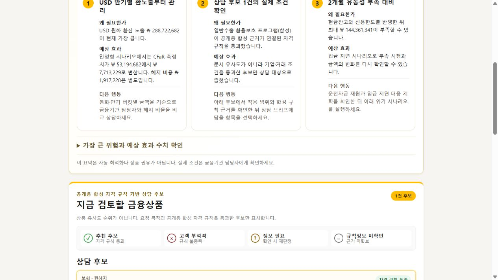
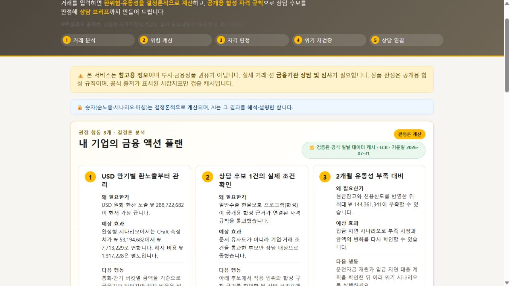
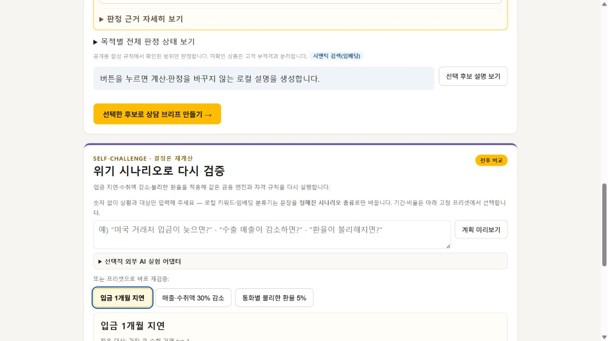
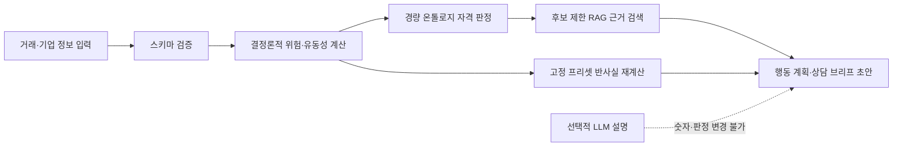

# TradePilot — 근거 기반 수출입 금융 AI 에이전트

[](https://github.com/qkrwlgh335-lab/tradepilot-ai-finance-agent/actions/workflows/ci.yml)


외화 거래의 현금흐름 위험을 계산하고, 근거가 연결된 자격 규칙으로 상담 후보를
좁힌 뒤 근거·반사실 시나리오·상담 브리프 초안을 제공하는 로컬 웹 프로토타입입니다.
제8회 KB AI Challenge 주제 6번 출품을 위해 개발했습니다.

> 이 저장소는 제8회 KB AI Challenge 출품작의 **공개용 일반화 버전**입니다. 원 출품작의
> 기관별 상품명·상세 조건·원문 조각은 공개하지 않고 합성 규칙으로 교체했습니다.
> 금융기관의 내부 승인모형이 아닌 **1차 스크리닝 모델**로,
> 결과는 실제 상품 가입·대출 승인·투자 또는 금융 자문을 의미하지 않습니다.

## 한눈에 보기

| 항목 | 내용 |
|---|---|
| 개발 기간 | 2026.07–2026.08 |
| 담당 범위 | 문제 정의, 아키텍처 설계, 프론트엔드, 위험 계산, 경량 온톨로지·후보 제한 RAG, 테스트·평가, 문서화 |
| 실행 구조 | Vanilla JavaScript 정적 웹 + Node.js 로컬 서버·선택적 AI 프록시 |
| 기본 동작 | API 키 없이 핵심 흐름 전체 실행, 키워드 폴백을 포함한 오프라인 모드 |
| 검증 결과 | 자동 테스트 676개 통과, 합성·고정 평가 34건과 품질지표 12/12 통과 |
| 공개 범위 | 코드·아키텍처·테스트는 유지하고 기관별 상품조건은 합성 규칙으로 일반화 |
| 데이터 경계 | 예시·합성 거래만 사용하며 실제 고객 데이터는 포함하지 않음 |

## 실행 화면

### 1. 거래 위험 요약과 근거



### 2. 개인화 금융 액션 플랜



### 3. 규칙 판정과 근거가 연결된 상담 후보


### 4. 반사실 시나리오 재계산



## 문제와 접근

수출입 기업의 거래 데이터, 환율 위험, 유동성, 상품 자격조건은 서로 다른 형식과
근거를 가집니다. 언어모델 하나가 입력부터 숫자 계산과 상품 추천까지 모두 결정하면
산술 오류와 근거 없는 적격 판정이 섞일 수 있습니다. TradePilot은 책임을 다음과 같이
분리했습니다.



- **계산은 코드가 담당합니다.** CFaR와 결제시점별 유동성은 순수 함수로 계산하고,
  LLM이 숫자를 만들거나 변경하지 못하게 했습니다.
- **자격은 규칙이 판정합니다.** 필수 정보가 없으면 적격으로 추정하지 않고
  `정보 필요`로 보류합니다.
- **RAG는 판정 뒤에만 동작합니다.** 이미 추론된 후보 범위에서 연결 근거를 찾는
  후보 제한 RAG로, 검색 결과가 탈락 후보를 되살리지 못합니다.
- **생성형 AI에는 경계를 둡니다.** 기본 설명은 로컬 결정론 템플릿이며, 선택적 외부
  설명도 비식별 allowlist와 사용자 승인 뒤에만 호출됩니다.

## 구현한 핵심 기능

1. CSV·JSON·직접 입력과 사용자의 파싱 결과 확정
2. 통화·만기 버킷별 CFaR 및 결제시점별 유동성 부족액 계산
3. 안정형·균형형·기회추구형 헤지 시나리오 비교
4. 위험·예상 효과·다음 행동을 묶은 금융 액션 플랜 3개
5. 경량 온톨로지와 출처 연결 규칙을 이용한 적격·부적격·정보 필요 분리
6. 추론된 후보 안에서만 동작하는 후보 제한 RAG
7. 키워드+임베딩 의도 분류와 낮은 신뢰도·모호한 대상 재질문
8. 고정 프리셋 게이트를 통과한 입금 지연·수취액 감소·불리한 환율 반사실 계산
9. 기업·유동성·CFaR·확인사항·규칙 근거를 담은 상담 브리프 초안

## 기술적 선택

| 영역 | 선택 | 이유 |
|---|---|---|
| UI | HTML, CSS, Vanilla JavaScript | 빌드 없이 실행 가능한 제출·시연 구조 |
| 계산 | JavaScript 순수 함수 | 재현 가능한 수치와 단위 테스트 분리 |
| 지식 표현 | JSON 경량 온톨로지·규칙 그래프 | 상품 조건·관계·출처 추적 |
| 검색 | 브라우저 임베딩 + 코사인 검색 + 키워드 폴백 | 오프라인 실패 시에도 핵심 흐름 유지 |
| 서버 | Node.js 로컬 HTTP 서버·선택적 프록시 | API 키를 브라우저에서 분리 |
| 검증 | Node.js Test Runner, 고정 골든, 합성 평가셋 | 계산·규칙·검색·보안 경계를 회귀 검증 |

`internal` Provider는 실서비스 전환용 인터페이스 자리만 있으며 현재 미구현입니다.
선택적 `external` 설명과 실험적 의도 분류는 `ANTHROPIC_API_KEY`와
`ANTHROPIC_MODEL`을 로컬 프록시 환경변수로 제공한 경우에만 활성화됩니다.

## 빠른 실행

Node.js 18 이상이 필요합니다. 핵심 데모에는 별도 npm 설치나 API 키가 필요하지 않습니다.

```powershell
npm test
npm start
```

Windows에서는 `START_DEMO.cmd`를 더블클릭해도 됩니다. 브라우저가 자동으로 열리지
않으면 `http://127.0.0.1:8000`에 접속하세요. 브라우저를 열지 않고 서버만 실행하려면:

```powershell
node scripts/dev-server.mjs
```

전체 실행·선택적 프록시·PowerShell 및 bash 명령·수동 브라우저 검증 절차는
[실행·검증 가이드](docs/RUNBOOK.md)를 참고하세요.

## 재현 가능한 검증

```powershell
npm test
npm run eval
npm run security:scan
```

| 검증 | 공개 시점 결과 | 해석 범위 |
|---|---:|---|
| 자동 테스트 | 676/676 통과 | 공개용 합성 규칙 전환 후 전체 회귀 테스트 재검증 |
| 고정 평가 | 34개 케이스 | 실제 고객이 아닌 합성·고정 평가셋 |
| 품질지표 | 12/12 통과 | 저장소의 명시된 평가 기준에 대한 결과 |
| 민감정보 검사 | key-like 값 0건 | 텍스트 파일 정적 패턴 검사; 전문 보안감사를 대체하지 않음 |

CI는 push와 pull request마다 위 세 명령을 실행합니다. 세부 통제와 미구현 범위는
[Governance Matrix](docs/governance-matrix.md)에 구분해 두었습니다.

## 저장소 구조

```text
.
├─ index.html                 # 진입 화면
├─ css/                       # 화면 스타일
├─ js/                        # UI, 계산, 규칙, 검색, 에이전트 로직
├─ data/                      # 검증 캐시, 규칙, 출처, 합성 예시
├─ test/                      # 자동 회귀 테스트
├─ eval/                      # 합성 평가셋과 평가 정의
├─ harness/                   # 고정 골든·평가 하네스
├─ scripts/                   # 실행, 데이터 갱신, 평가, 보안 검사
├─ docs/                      # 실행·거버넌스 문서와 화면 캡처
└─ proxy.mjs                  # 선택적 외부 AI 로컬 프록시
```

## 한계와 다음 단계

- CFaR는 통화·만기 버킷 결과를 보수적으로 단순 합산하며, 버킷 간 상관관계·금리·
  신용스프레드·브리지금융을 모델링하지 않습니다.
- ECB 기준환율과 공개 통계 캐시를 사용하며 체결환율·실시간 시세·기업별 예측값이 아닙니다.
- 실제 고객 발화·거래가 아닌 합성 데이터로 평가했습니다.
- 공개 저장소의 상품 조건은 [합성 규칙 사양](docs/PUBLIC_DEMO_RULES.md)이며 실제 상품조건이 아닙니다.
- 실제 적용에는 승인된 상품 마스터·공식 원문·모델 검증·
  IAM/RBAC·DLP·감사로그·승인 워크플로가 필요합니다.
- `internal` AI Provider와 금융기관 업무시스템 연계는 현재 미구현입니다.

## 출처·AI 보조 개발·이용 범위

외부 데이터와 모델의 출처 및 이용조건은 [THIRD_PARTY_NOTICES.md](THIRD_PARTY_NOTICES.md)에
정리했습니다. 기관별 상품조건을 일반화한 기준은 [공개용 합성 규칙 사양](docs/PUBLIC_DEMO_RULES.md)에
명시했습니다. 이 프로젝트는 생성형 AI를 코드 초안, 테스트 아이디어, 문서 검토에
보조적으로 사용했습니다. 요구사항 정의, 시스템 경계 설계, 공식 출처 확인, 실행·테스트,
결과 검토와 최종 판단은 작성자가 수행했습니다.

작성자: **박지호**

이 저장소에는 별도의 오픈소스 라이선스를 부여하지 않았습니다. 저장소 열람과 채용 검토
목적 외 복제·배포·상업적 이용은 허용되지 않습니다. 제3자 데이터·모델·상표는 각 권리자의
조건을 따릅니다.
